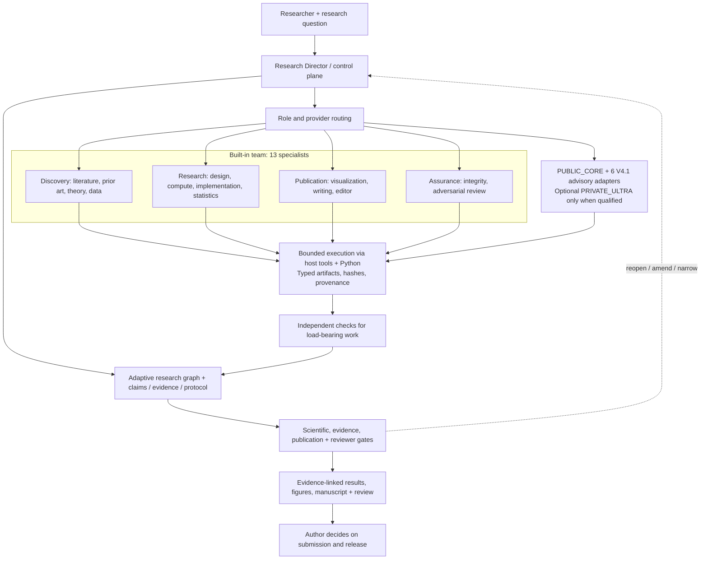

# CS Nature Paper V4.1.0

[简体中文](README_zh.md) · [v4.1.0](https://github.com/KaiserIIII/cs-nature-paper-skill/releases/tag/v4.1.0) · [MIT License](LICENSE)

An Agent Skill and Python runtime for managing computer-science research workflows. It connects research questions, literature, experimental protocols, code, results, figures, manuscript claims, and review findings through explicit provenance records.

## System at a glance



The specialist and provider layers produce candidate artifacts; they cannot independently approve scientific claims or authorize external release.

## Core capabilities

- Route work through literature, experiment, analysis, writing, and review roles.
- Track dependencies and progress in a research graph with a hash-linked event log.
- Bind artifacts to their inputs, environment, code version, and verification status.
- Separate exploratory results from confirmatory evidence.
- Check scientific validity, evidence sufficiency, publication sufficiency, reviewer completeness, and submission readiness independently.
- Load audited resources from pinned upstream commits, with licenses and source manifests.

V4.1.0 includes six callable offline advisory providers. Their software integration is documented in the [release report](docs/v4.1.0-release-report.md); formal scientific qualification and the broader system comparison remain incomplete.

## Install

Download the [v4.1.0 source archive](https://github.com/KaiserIIII/cs-nature-paper-skill/archive/refs/tags/v4.1.0.zip) and extract it to a new skill directory. The tag resolves to:

```text
4d5c6d00c6af81705e62e783a0b8cabb34313034
```

For Codex, the directory is normally `~/.codex/skills/cs-nature-paper/`. Keep existing installations with local changes separate, and review the source and dependency records before use.

## Use

```text
Use $cs-nature-paper in copilot mode.
Study this research question using the code and data in the workspace.
Start with related work and feasibility, then propose an experiment protocol.
Keep every claim linked to its evidence.
```

Use `review` for an existing draft and `revision` for reviewer feedback. The host session supplies execution tools; the skill supplies routing, contracts, state, and checks.

## Architecture

| Area | Location |
| --- | --- |
| Skill entry point | [SKILL.md](SKILL.md) |
| Python runtime | [scripts/](scripts/) |
| Workflow contracts | [references/](references/) |
| Schemas and registries | [assets/](assets/) |
| Tests | [tests/](tests/) |
| Dependency provenance | [vendor/](vendor/) |
| Release integrity | [SHA256SUMS.txt](SHA256SUMS.txt), [release_manifest.json](release_manifest.json) |

## Documentation

- [Workflow and command reference](docs/user-guide.md)
- [V4.1.0 release report](docs/v4.1.0-release-report.md)
- [Changelog](CHANGELOG.md)

The runtime checks artifact integrity and workflow state. Scientific judgment and submission decisions remain the author's responsibility; software checks do not establish research novelty or predict acceptance.
