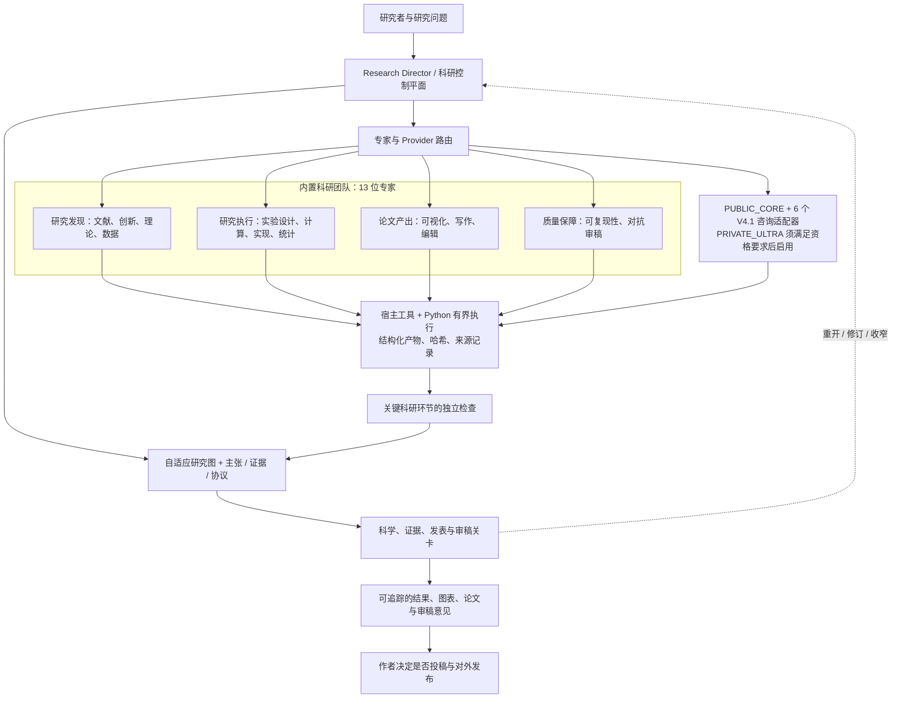

# CS Nature Paper V4.1.0

[English](README.md) · [v4.1.0](https://github.com/KaiserIIII/cs-nature-paper-skill/releases/tag/v4.1.0) · [MIT 许可证](LICENSE)

用于计算机科学研究流程的 Agent Skill 与 Python 运行时，将研究问题、文献、实验协议、代码、结果、图表、论文主张和审稿意见连接为可追踪的证据记录。

## 系统结构一览



专家与 Provider 层只提交待验证产物，不能自行确认科研结论，也不能授权对外发布。

## 核心能力

- 在文献、实验、分析、写作和审查角色之间路由任务。
- 使用研究图记录依赖与进度，以哈希链事件日志保留状态变化。
- 将产物绑定到输入、环境、代码版本和验证状态。
- 区分探索性结果与确认性证据。
- 分别检查科学有效性、证据充分性、发表充分性、审稿完整性和投稿就绪度。
- 从固定的上游 commit 加载审核过的资源，记录许可证与来源清单。

V4.1.0 包含六个可离线调用的咨询型 provider，其软件集成情况见 [发布报告](docs/v4.1.0-release-report.md)。正式科学资格验证和更广泛的系统比较仍未完成。

## 安装

下载 [v4.1.0 源码包](https://github.com/KaiserIIII/cs-nature-paper-skill/archive/refs/tags/v4.1.0.zip)，解压到新的技能目录。该 tag 对应的 commit 为：

```text
4d5c6d00c6af81705e62e783a0b8cabb34313034
```

Codex 的常用目录为 `~/.codex/skills/cs-nature-paper/`。已有本地修改的安装应单独保留，使用前审核源码与依赖记录。

## 使用

```text
使用 $cs-nature-paper 的 copilot 模式。
结合工作区中的代码和数据研究这个问题。
先核对相关工作和可行性，再提出实验协议。
保持每项主张与证据之间的对应关系。
```

已有论文可使用 `review` 模式，处理审稿意见可使用 `revision` 模式。宿主会话提供执行工具，技能负责路由、任务契约、状态与检查。

## 架构

| 模块 | 位置 |
| --- | --- |
| 技能入口 | [SKILL.md](SKILL.md) |
| Python 运行时 | [scripts/](scripts/) |
| 工作流契约 | [references/](references/) |
| Schema 与注册表 | [assets/](assets/) |
| 测试 | [tests/](tests/) |
| 依赖来源 | [vendor/](vendor/) |
| 发布完整性 | [SHA256SUMS.txt](SHA256SUMS.txt)、[release_manifest.json](release_manifest.json) |

## 文档

- [工作流与命令参考](docs/user-guide.zh-CN.md)
- [V4.1.0 发布报告](docs/v4.1.0-release-report.md)
- [变更记录](CHANGELOG.md)

运行时检查产物完整性与工作流状态。科学判断和投稿决定由作者负责；软件检查不构成研究新颖性证明，也不预测录用结果。
